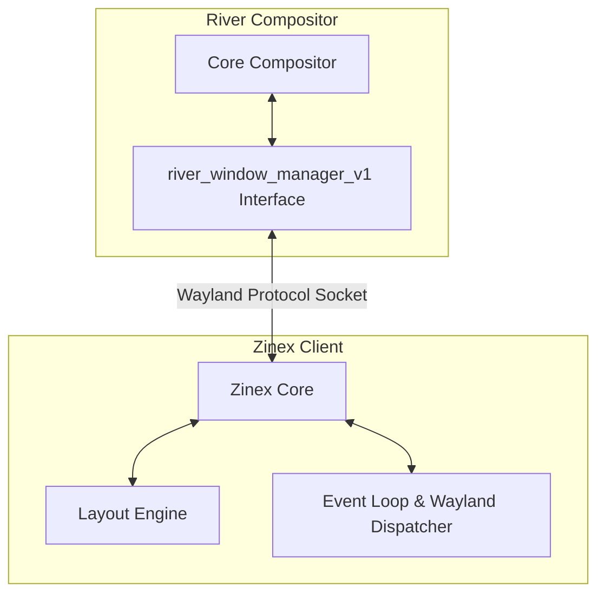
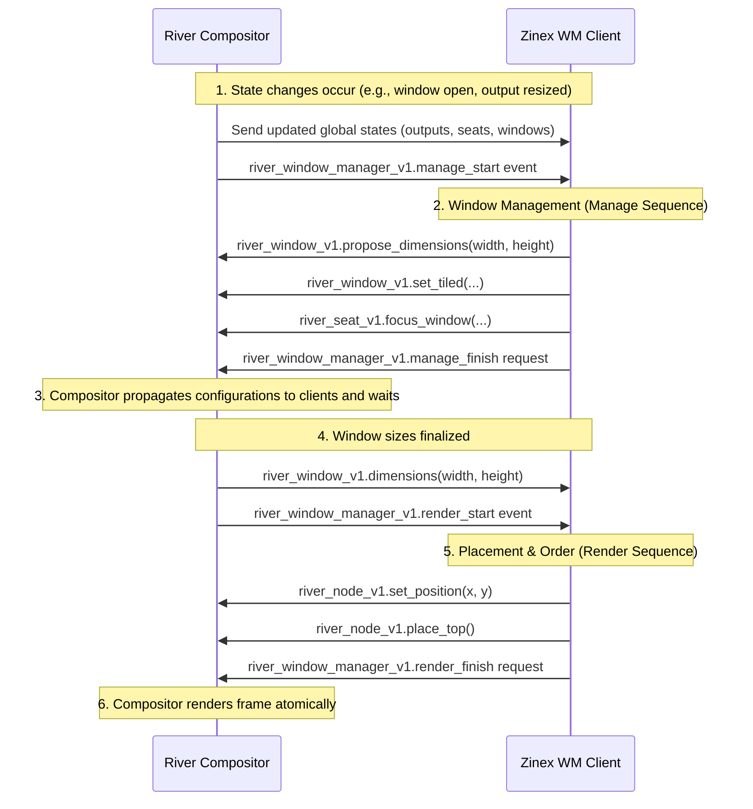

# Zinex Architecture

Zinex is an external tiling layout generator for the **River** Wayland compositor. Unlike traditional window managers that embed layout logic directly within the compositor shell, River separates the layout calculations from the compositor process. It communicates with layout generators (like Zinex) via the custom `river-window-management-v1` Wayland protocol.

This document describes the high-level architecture of Zinex, its event-driven model, double-buffered sequence loop, core data structures, and layout algorithms.

---

## High-Level Overview

Zinex operates as a standalone Wayland client. It connects to the Wayland display socket hosted by the River compositor, binds to River's custom interfaces, tracks global states (outputs, seats, windows), and dynamically calculates layout geometry based on its internal algorithms.

---

## Core Components

The codebase is structured to separate protocol handling, state tracking, and layout calculations:

1. **`src/main.zig`**: The core driver of Zinex. It:
   * Establishes the Wayland display connection.
   * Obtains the registry and binds interfaces (`wl_compositor`, `river_window_manager_v1`).
   * Manages state tracking for outputs, seats, and windows.
   * Dispatches events in an infinite event loop.
2. **`src/root.zig`**: Library entry point reserved for shared calculations, utilities, and helper functions.
3. **`layout-engine/`**: A dedicated folder intended for modular layout strategies (e.g. Master-Stack, Grid, Fibonnaci, Columns).
4. **`panels/`**: A dedicated folder intended for bar or status panel integration.
5. **`protocol/`**: Custom Wayland XML interface definitions used to generate type-safe Zig bindings at build time.

---

## Core Data Structures

In `src/main.zig`, the `Zinex` struct encapsulates all client-side state:

### 1. `Zinex`
*   `allocator`: Memory allocator used to dynamically instantiate/destroy tracking objects.
*   `display` & `registry`: Native Wayland connection hooks.
*   `river_wm`: Pointer to the active `river.WindowManagerV1` interface.
*   `outputs`: Dynamic array (`std.ArrayList(*Output)`) of active physical/logical outputs.
*   `windows`: Dynamic array (`std.ArrayList(*Window)`) of open application windows.
*   `seats`: Dynamic array (`std.ArrayList(*Seat)`) representing inputs, used for delegating focus.

### 2. `Output`
Tracks screen layout coordinates and dimensions:
*   `proxy`: Pointer to `river.OutputV1`.
*   `name`: Wayland registry global ID.
*   `x`, `y`: Global pixel offsets in the logical compositor coordinate space.
*   `width`, `height`: Screen resolution dimensions.

### 3. `Window`
Represents an active client window:
*   `proxy`: Pointer to `river.WindowV1`.
*   `node`: Pointer to `river.NodeV1`, used for placing and ordering the window's visual representation.
*   `width`, `height`: Current width and height.
*   `title` / `app_id`: Application metadata.

---

## The Protocol Loop: Manage vs. Render

To ensure frame-perfect updates without flickering or tearing, River uses double-buffered state updates divided into two sequential phases:

### Sequence Rules

1. **Manage Sequence (Window Configuration)**:
   * **Trigger**: Initiated by the compositor's `manage_start` event.
   * **Scope**: Modifies window dimensions (`proposeDimensions`), tiling parameters (`setTiled`), and input focus (`focusWindow`).
   * **Terminator**: Concluded by the client's `manage_finish` request.
   * *Rule*: Window management requests outside this sequence result in a protocol error.

2. **Render Sequence (Visual Layout Application)**:
   * **Trigger**: Initiated by the compositor's `render_start` event after client windows have acknowledged their sizes.
   * **Scope**: Modifies absolute positions (`setPosition`) and stacking order (`placeTop`, `placeBottom`, `placeAbove`, `placeBelow`).
   * **Terminator**: Concluded by the client's `render_finish` request.
   * *Rule*: Positioning and ordering requests outside this sequence result in a protocol error.

---

## Layout Algorithm: Master-Stack

Zinex currently implements a **Master-Stack** layout model, dividing screen space between a dominant "Master" window and a vertical stack of "Stack" windows.

### Layout Calculations

Given a logical screen width $W$, height $H$, starting coordinates $(ox, oy)$, and a count of active windows $n$:

1.  **Single Window ($n = 1$)**:
    *   **Proposed size**: $W \times H$
    *   **Tiling state**: Fully tiled (no border directions).
    *   **Render position**: $(ox, oy)$

2.  **Multiple Windows ($n > 1$)**:
    *   **Master Window** (index `0`):
        *   **Proposed size**: $\lfloor W / 2 \rfloor \times H$
        *   **Tiling state**: Tiled on the right edge (`right = true`).
        *   **Render position**: $(ox, oy)$
    *   **Stack Windows** (indices $1 \le i < n$):
        *   **Proposed size**: $\lfloor W / 2 \rfloor \times \text{stack\_h}$, where $\text{stack\_h} = \lfloor H / (n - 1) \rfloor$.
        *   **Tiling state**: Tiled on the left edge (`left = true`).
        *   **Render position**: $(stack\_x, win\_y)$ where:
            *   $stack\_x = ox + \lfloor W / 2 \rfloor$
            *   $win\_y = oy + (i - 1) \times \text{stack\_h}$

---

## Future Architecture Plans

* **Dynamic Layout Loading**: Creating a clean polymorphic interface in `layout-engine/` to switch between layouts (e.g. spiral, grid, deck) dynamically via command-line arguments or IPC.
* **Multi-output Support**: Currently, Zinex handles layout management targeting the first active output (`outputs.items[0]`). Future revisions will support multi-monitor workspaces and tag/workspace management across different screens.
